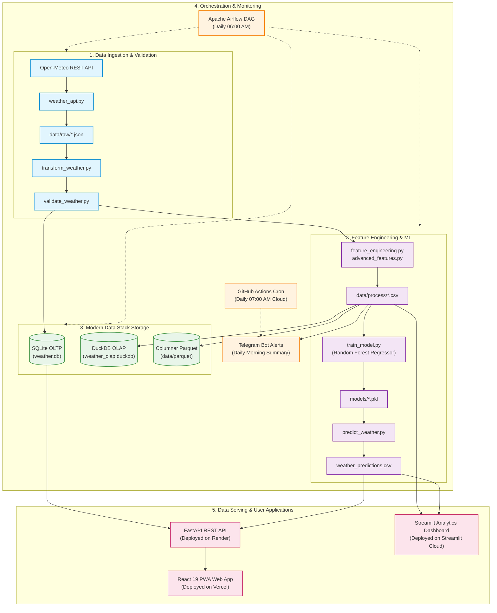

# 🌦️ End-to-End Weather Data Pipeline & AI Forecasting Platform

An enterprise-grade, end-to-end Data Engineering & Machine Learning pipeline that ingests real-time hourly meteorological data, validates data quality, persists across OLTP (SQLite) and OLAP (DuckDB + Parquet) storage, predicts future temperatures using Random Forest regression, orchestrates workflows via Apache Airflow, and serves insights through a FastAPI REST API, a Streamlit analytics dashboard, and an installable React PWA.

---

## 🌐 Live Demonstrations

| Platform                         | Type                                        | URL                                                                                                      |
| :------------------------------- | :------------------------------------------ | :------------------------------------------------------------------------------------------------------- |
| **📱 Mobile PWA App**      | Progressive Web App (React 19, TailwindCSS) | [weather-data-pipeline-one.vercel.app](https://weather-data-pipeline-one.vercel.app)                      |
| **⚡ Production API**      | FastAPI REST API + Interactive Swagger UI   | [weather-data-pipeline-er66.onrender.com/docs](https://weather-data-pipeline-er66.onrender.com/docs)      |
| **📊 Analytics Dashboard** | Streamlit Interactive Cloud Dashboard       | [weather-data-pipeline.streamlit.app](https://weather-data-pipeline-2tnainwikjfawai76ekqqn.streamlit.app) |

---

## 🏗️ System Architecture

# 🌦️ End-to-End Weather Data Pipeline & AI Forecasting Platform

An enterprise-grade, end-to-end Data Engineering & Machine Learning pipeline that ingests real-time hourly meteorological data, validates data quality, persists across OLTP (SQLite) and OLAP (DuckDB + Parquet) storage, predicts future temperatures using Random Forest regression, orchestrates workflows via Apache Airflow, and serves insights through a FastAPI REST API, a Streamlit analytics dashboard, and an installable React PWA.

---

## 🌐 Live Demonstrations

| Platform                         | Type                                        | URL                                                                                                      |
| :------------------------------- | :------------------------------------------ | :------------------------------------------------------------------------------------------------------- |
| **📱 Mobile PWA App**      | Progressive Web App (React 19, TailwindCSS) | [weather-data-pipeline-one.vercel.app](https://weather-data-pipeline-one.vercel.app)                      |
| **⚡ Production API**      | FastAPI REST API + Interactive Swagger UI   | [weather-data-pipeline-er66.onrender.com/docs](https://weather-data-pipeline-er66.onrender.com/docs)      |
| **📊 Analytics Dashboard** | Streamlit Interactive Cloud Dashboard       | [weather-data-pipeline.streamlit.app](https://weather-data-pipeline-2tnainwikjfawai76ekqqn.streamlit.app) |

---

## 🏗️ System Architecture

