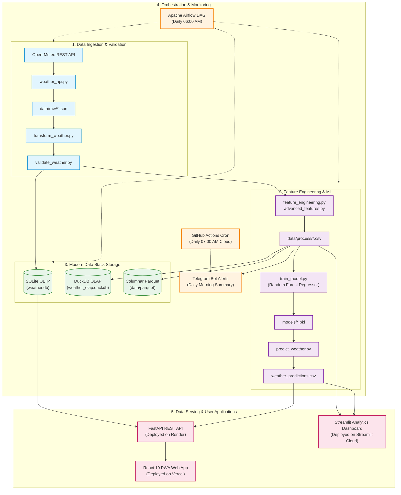

# 🌦️ End-to-End Weather Data Pipeline & AI Forecasting Platform

[](https://github.com/QuangHuy-68/weather-data-pipeline/actions)
[](https://www.python.org/)
[](https://weather-data-pipeline-er66.onrender.com/docs)
[](https://weather-data-pipeline-one.vercel.app)
[](https://weather-data-pipeline-2tnainwikjfawai76ekqqn.streamlit.app)
[](https://opensource.org/licenses/MIT)

An enterprise-grade, end-to-end Data Engineering & Machine Learning pipeline that ingests real-time hourly meteorological data, validates data quality, persists across OLTP (SQLite) and OLAP (DuckDB + Parquet) storage, predicts future temperatures using Random Forest regression, orchestrates workflows via Apache Airflow, and serves insights through a FastAPI REST API, a Streamlit analytics dashboard, and an installable React PWA.

---

## 🌐 Live Demonstrations

| Platform                         | Type                                        | URL                                                                                                      |
| :------------------------------- | :------------------------------------------ | :------------------------------------------------------------------------------------------------------- |
| **📱 Mobile PWA App**      | Progressive Web App (React 19, TailwindCSS) | [weather-data-pipeline-one.vercel.app](https://weather-data-pipeline-one.vercel.app)                      |
| **⚡ Production API**      | FastAPI REST API + Interactive Swagger UI   | [weather-data-pipeline-er66.onrender.com/docs](https://weather-data-pipeline-er66.onrender.com/docs)      |
| **📊 Analytics Dashboard** | Streamlit Interactive Cloud Dashboard       | [weather-data-pipeline.streamlit.app](https://weather-data-pipeline-2tnainwikjfawai76ekqqn.streamlit.app) |

---

## 🏗️ System Architecture



---

## ⚡ Key Highlights & Engineering Features

- **Automated ETL Pipeline:** Robust data extraction, type conversion, timezone handling, missing-value imputation, and schema validation.
- **Dual-Storage Architecture:**
  - **OLTP (SQLite):** Normalized relational schema with primary/foreign keys for transactional operations.
  - **OLAP (DuckDB + Parquet):** Columnar storage achieving 10x-50x faster analytical aggregation queries.
- **Machine Learning Forecasting:** Time-series temperature regression utilizing lag features (`lag_1h`, `lag_24h`, rolling averages) with scikit-learn's `RandomForestRegressor`.
- **RESTful API Service:** Production FastAPI application with Pydantic schema validation, CORS middleware, and automated OpenAPI (Swagger) documentation.
- **Multi-Client Delivery:**
  - **Mobile PWA:** Installable standalone Progressive Web App with offline caching, responsive dark UI, and interactive Recharts visualizations.
  - **Business BI Dashboard:** Streamlit application providing geographical maps, historical KPI metrics, and ML comparison charts.
- **Workflow Orchestration:** Apache Airflow DAG defining task dependencies, automatic retries, and scheduled execution.
- **Autonomous Cloud Cron:** GitHub Actions workflow running at 07:00 AM daily to fetch data, retrain models, update cloud databases, and dispatch proactive Telegram Bot alerts.
- **CI/CD Quality Assurance:** GitHub Actions pipeline executing 17+ unit tests with `pytest` on every push and pull request.

---

## 🛠️ Technology Stack

| Domain                       | Technologies & Libraries                                  |
| :--------------------------- | :-------------------------------------------------------- |
| **Language & Runtime** | Python 3.12, Node.js 20+                                  |
| **Data Processing**    | Pandas, NumPy                                             |
| **Modern Data Stack**  | DuckDB, Apache Parquet, PyArrow, SQLite3                  |
| **Machine Learning**   | Scikit-Learn, Joblib                                      |
| **API & Backend**      | FastAPI, Uvicorn, Pydantic, HTTPX                         |
| **Frontend & UI**      | React 19, Vite, TailwindCSS, Recharts, VitePWA            |
| **BI & Analytics**     | Streamlit, Plotly Express                                 |
| **Orchestration**      | Apache Airflow 2.10 / 3.x, GitHub Actions Cron            |
| **Testing & CI/CD**    | Pytest, GitHub Actions                                    |
| **Cloud Deployment**   | Vercel (Frontend), Render.com (API), Streamlit Cloud (BI) |

---

## 🚀 Getting Started Locally

### 1. Prerequisites

- Python 3.12+
- Node.js 18+ (for PWA frontend)
- Git

### 2. Clone and Setup Environment

```bash
git clone https://github.com/QuangHuy-68/weather-data-pipeline.git
cd weather-data-pipeline

# Create and activate Python virtual environment
python -m venv .venv
# On Windows:
.venv\Scripts\activate
# On Linux/macOS:
source .venv/bin/activate

# Install Python dependencies
pip install -r requirements.txt
```

### 3. Environment Configuration

Create a `.env` file in the root directory:

```env
LATITUDE=10.8231
LONGITUDE=106.6297
TIMEZONE=Asia/Ho_Chi_Minh
TELEGRAM_BOT_TOKEN=your_bot_token_optional
TELEGRAM_CHAT_ID=your_chat_id_optional
```

### 4. Execute the End-to-End Pipeline

```bash
# Run the entire pipeline in sequence
python pipeline.py

# Or run specific pipeline steps:
python pipeline.py --steps api,transform,validate,database,ml_train,ml_predict
```

### 5. Launch Services

#### FastAPI Backend Server:

```bash
uvicorn src.api.main:app --reload --port 8000
# Open documentation: http://localhost:8000/docs
```

#### Streamlit Analytics Dashboard:

```bash
streamlit run app.py
# Open dashboard: http://localhost:8501
```

#### React PWA Frontend:

```bash
cd weather-pwa
npm install
npm run dev
# Open PWA: http://localhost:5173
```

---

## 🧪 Running Automated Tests

Run the complete test suite with `pytest`:

```bash
pytest tests/ -v
```

---

## 👤 Author

- **Quang Huy** - [GitHub](https://github.com/QuangHuy-68)
- Project Repository: [weather-data-pipeline](https://github.com/QuangHuy-68/weather-data-pipeline)
